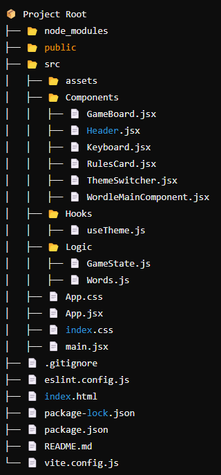

# WORDLE GAME 

## Overview  
React Wordle is a clone of the popular word game Wordle. Players attempt to guess a five-letter word within six tries. After each guess, the letters change color to indicate how close the guess was to the correct word: green for correct letters in the correct position, yellow for correct letters in the wrong position, and gray for incorrect letters.

## Live Demo  
Explore the live version of the project here: [Demo](https://worlde-game-git-main-harshits1r8as-projects.vercel.app/)

## Folder Structure  



## Features  
- Interactive gameplay with visual feedback on guesses.
- Virtual keyboard for intuitive input, especially on mobile devices.
- Responsive design for seamless experience across devices.


### Installation


1. Clone the repo
   ```sh
   git clone https://github.com/HarshitSharma-h8/worlde_game.git
   ```
3. Install NPM packages
   ```sh
   npm install
   ```
4. Run the project with npm start
   ```sh
   npm start
   ```
5. Run the CSS watch script using 
   ```sh
   npm run dev
   ```


